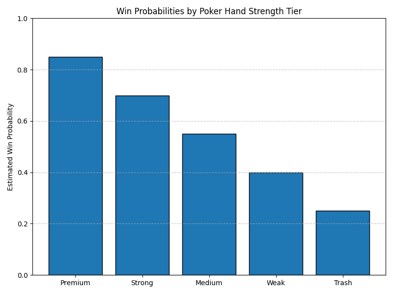

# Poker Monte Carlo Simulator

This project uses Monte Carlo simulation to estimate the probability of winning a game of Texas Hold’em with a given a user inputted hand. It models 1M+ randomized trials per input using simulated community cards and random opponent hands, allowing users to assess expected performance and strategic value under uncertainty.

---

### Key Features

- **Simulates 1M+ poker hands:** Run repeated simulations to evaluate win/tie/loss likelihood for any user-defined hole cards
- **Vectorized evaluation logic:** Uses rank-based scoring to compare hand strength efficiently
- **Adversarial modeling:** Random opponent hands simulate real uncertainty and bluff potential
- **Visualized outcome distributions:** matplotlib chart illustrates expected win rates by hand tier
  
- **Interactive input:** Prompts user to enter specific cards to test strategy in real-time
- **Custom game engine:** Handles card removal, shuffling, and evaluation for both players on random boards

---

### How to Run

```bash
python poker_monte_carlo_simulator.py
